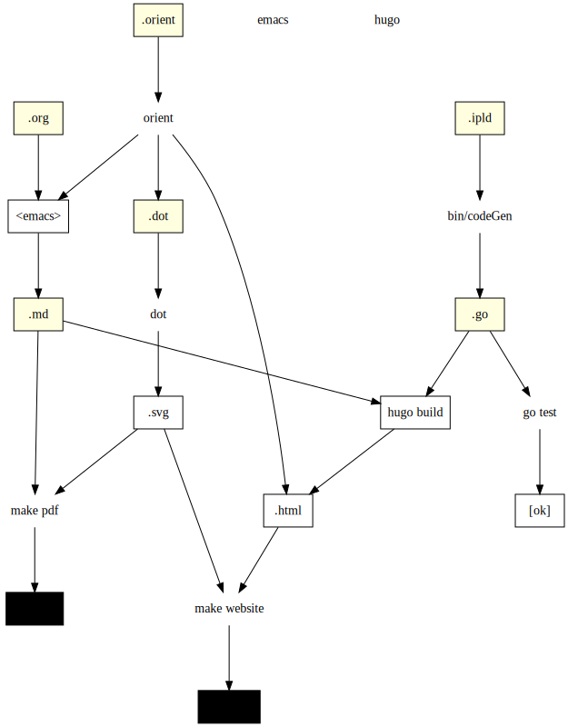

# Filecoin Specification

This is the [Filecoin Specification](https://github.com/filecoin-project/specs), a repository that contains documents, code, models, and diagrams that constitute the specification of the [Filecoin Protocol](https://filecoin.io). This repository is the singular source of truth for the Filecoin Protocol. All implementations of the Filecoin Protocol should match and comply with the descriptions, interfaces, code, and models defined in this specification.

## View Website

You can view and explore the Filecoin Specification via its [website rendering](https://filecoin-project.github.io/specs). You do not need to download and work with this repository.

## Contributing

Please [read the spec process](https://filecoin-project.github.io/specs/#intro__process). Please file PRs on github with fixes.

## Develop

### Install

```
git clone https://github.com/filecoin-project/spec filecoin-specs
cd filecoin-specs
make deps-basic
```

### Build

```
make build
```

### Serve

```
make serve
```

This will write out an HTTP address to check out with your browser. Most likely: http://localhost:1313

### Website

```
make website
```

### Diagrams

Install dependencies for digram making
```
make deps-diag
```

Render diagrams
```
make diagrams
```
Make sure to check in your rendered output (`*.dot.svg` and `*.mmd.svg`) so that others dont need to install diagram building deps.

### Orient and Org mode

Install dependencies for org mode and orient

```
make deps-orient
```

Without these, you won't be able to compile `.org` files, and they may be missing from the document output.

## Overviews

### Build System Overview

Given the complexity of the protocol, a build system is introduced to leverage the power of modern programs and improve understanding, efficiency, consistency, and velocity of Filecoin spec development. The Filecoin spec is organized into subcomponents as defined in `src/` with high-level and introductory sections in `Introduction` and `Algorithmns`, detailed spec on different Filecoin systems in `Systems`, followed by `Listings`, `Glossary`, and `Appendix`.

For every subsystem in the Filecoin spec, it must always have a markdown file that specifies the component. Wherever possible and necessary, an `.id` file should be included to automatically generate compiled `.go` files that can be tested to ensure build consistency and served from `hugo`. Similarly, contributors should include an `.orient` file that describes mathematical constraints in a component of the system. `Orient`, a language created to write constraints and models about the system, is used to perform ubercalc and generate artifacts about the system. To facilitate in line code display, an `.org` file can also be included to interweave output from ubercalc and markdown.

 <!--
 An architectural diagram of the build system can be found below.
  This is outdated. fix it and bring back.

-->

### System Overview


## Detailed Build Usage

```makefile
> make help
SYNOPSIS
  make -- filecoin spec build toolchain commands

USAGE
  make deps-basic  run this once, to install & build basic dependencies
  make build       run this every time you want to re-build artifacts

MAIN TARGETS
  make help        description of the targets (this message)
  make build       build all final artifacts (website only for now)
  make test        run all test cases (test-code only for now)
  make drafts      publish artifacts to ipfs and show an address
  make publish     publish final artifacts to spec website (github pages)
  make clean       removes all build artifacts. you shouldn't need this
  make serve       start hugo in serving mode -- must run 'make build' on changes manually

INSTALL DEPENDENCIES
  make deps        install ALL dependencies of this tool chain
  make deps-basic  install minimal dependencies of this tool chain
  make deps-diag   install dependencies for rendering diagrams
  make deps-orient install dependencies for running orient
  make deps-ouser  install dependencies for orient user-environment tooling
  make bins        compile some build tools whose source is in this repo

INTERMEDIATE TARGETS
  make website     build the website artifact
  make diagrams    build diagram artifacts ({dot, mmd} -> svg)
  make org2md      run org mode to markdown compilation

HUGO TARGETS
  make hugo-src    copy sources into hugo dir
  make build-hugo  run the hugo part of the pipeline
  make watch-hugo  watch and rebuild hugo

CODE TARGETS
  make gen-code    generate code artifacts (eg id -> go)
  make test-code   run test cases in code artifacts
  make build-code  build all src go code (test it)
  make clean-code  remove build code artifacts
  make watch-code  watch and rebuild code

CLEAN TARGETS
  make clean       remove all build artifacts
  make clean-deps  remove (some of) the dependencies installed in this repo
  make clean-hugo  remove intermediate hugo artifacts
  make clean-code  remove build code artifacts

WATCH TARGETS
  make serve-and-watch -j2  serve, watch, and rebuild all - works for live edit
  make watch-code           watch and rebuild code
  make watch-hugo           watch and rebuild hugo
```
