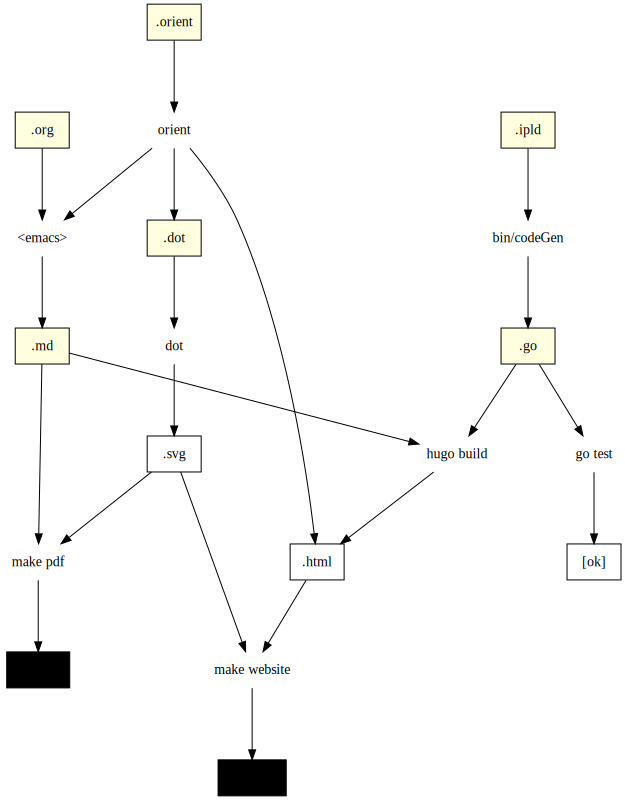
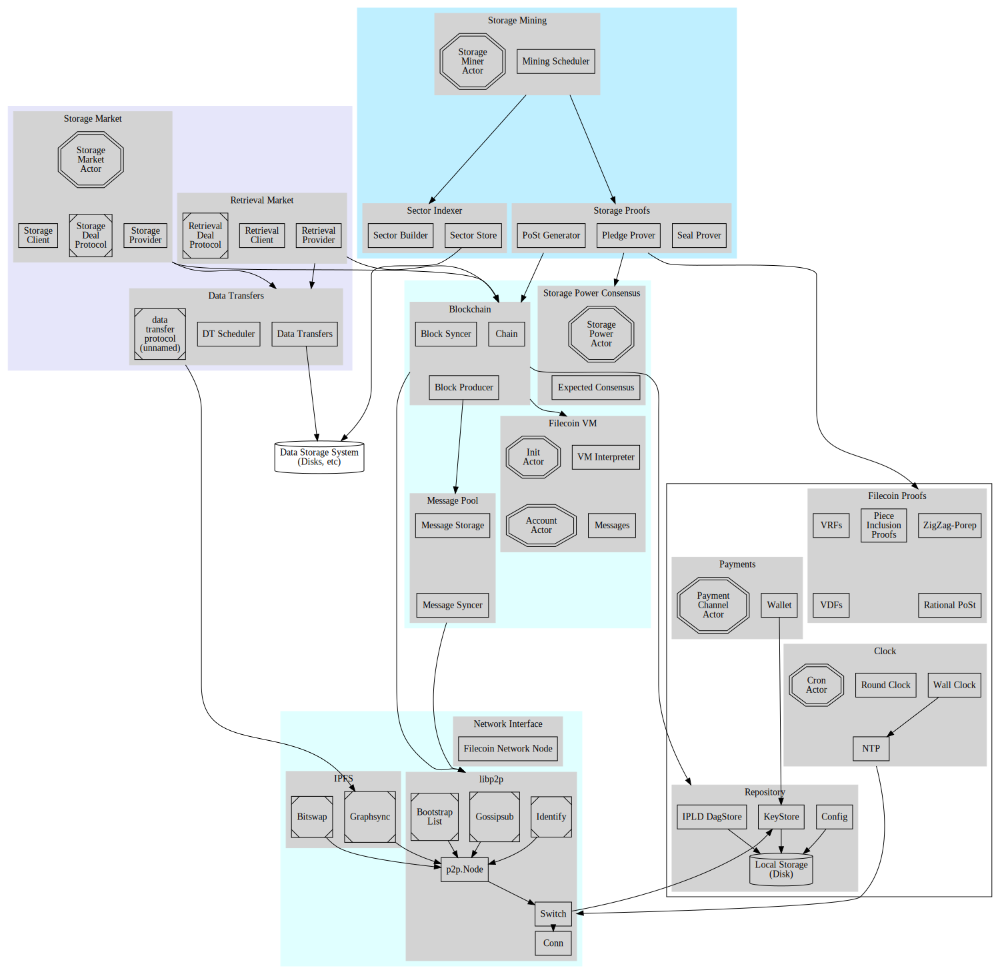

Drafts of Filecoin Spec refactoring

## Build System Overview
Filecoin Spec is the source of truth for the Filecoin protocol. All implementations of the Filecoin spec should match and comply with the descriptions, interfaces, and models defined in the spec. Given the complexity of the protocol, a build system is introduced to leverage the power of modern programs and improve understanding, efficiency, consistency, and velocity of Filecoin spec development. The Filecoin spec is organized into subcomponents as defined in `content/docs` with high-level and introductory sections in `Introduction` and `Algorithmns`, detailed spec on different Filecoin subsystems in `Subsystems`, followed by `Listings`, `Glossary`, and `Appendix`.

For every subsystem in the Filecoin spec, it must always have a markdown file that specifies the component. Wherever possible and necessary, a `.mgo` file should be included to automatically generate compiled `.go` files that can be tested to ensure build consistency and served from `hugo`. Similarly, contributors should include an `.orient` file that describes mathematical constraints in a component of the system. `Orient`, a language created to write constraints and models about the system, is used to perform ubercalc and generate artifacts about the system. To facilitate in line code display, an `.org` file can also be included to interweave output from ubercalc and markdown. An architectural diagram of the build system can be found below.



## Developing

### Install

1. Install [Hugo](https://gohugo.io) (at least works with latest, `v0.57.2`)
2. Then run:
  ```
  git submodule init
  git submodule update
  ```

### Compile

```
make
```

*Note that you must run this from the top-level specs directory*

### Serve

```
make serve
```

will write out an HTTP address to check out with your browser

### Website

```
make website
```

## System Overview


