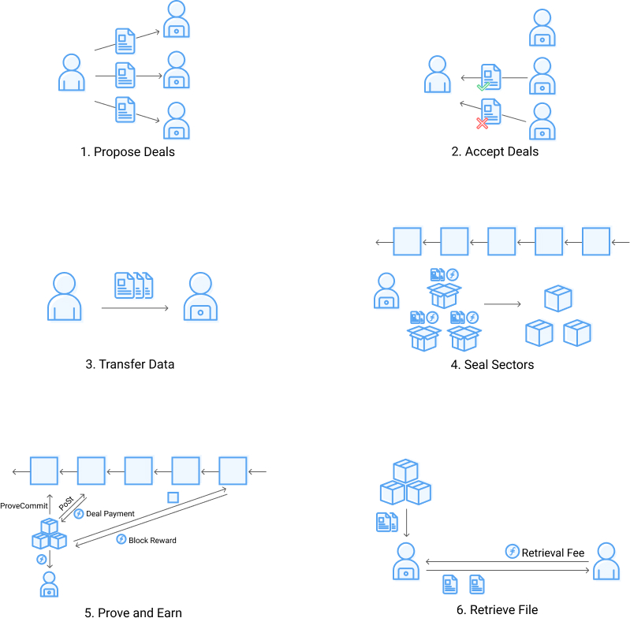
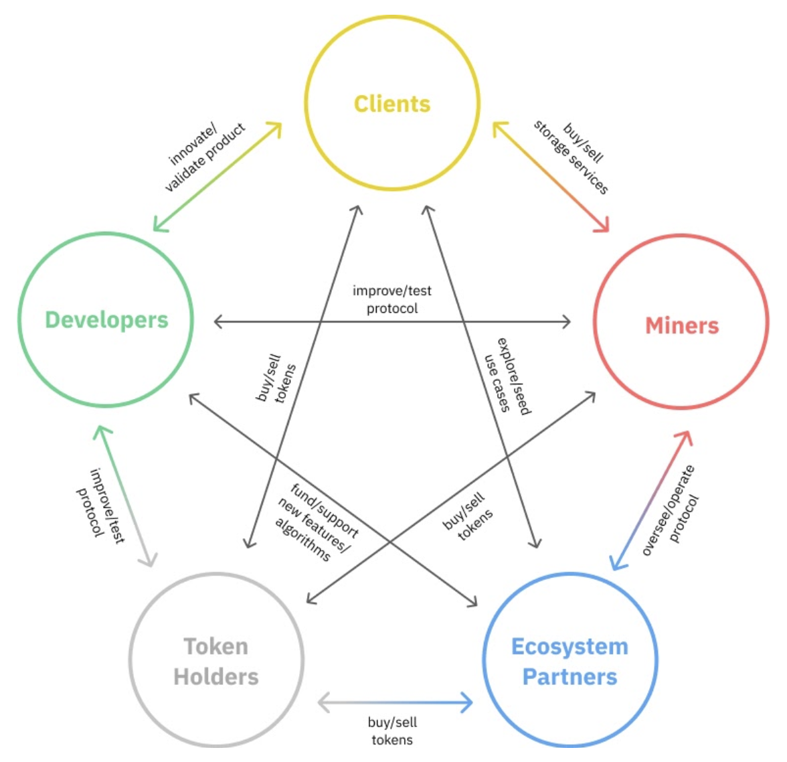
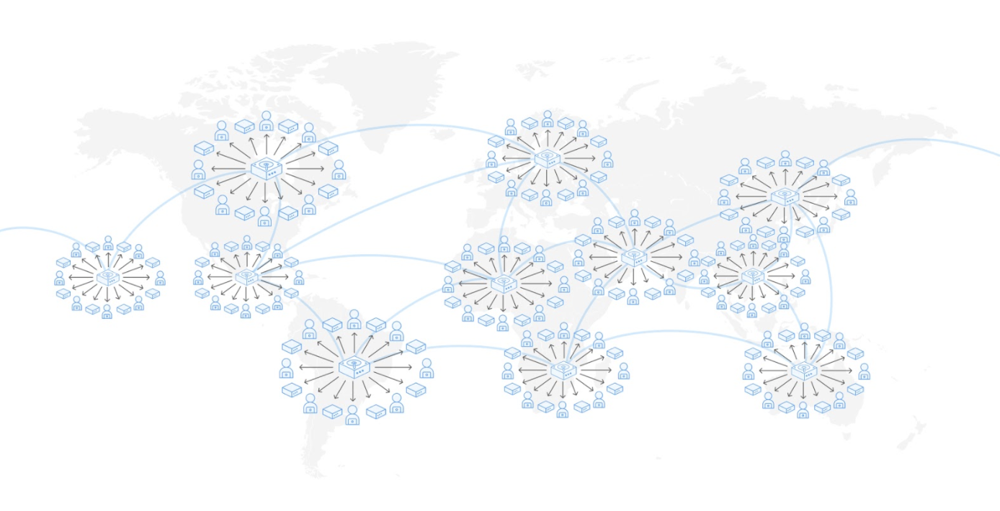

# Filecoin Economy

## A Market for Data

Filecoin is more than a network; the protocol lays the groundwork for a market economy built around a marketplace for the storage and retrieval of data.

Markets possess the required mechanisms to balance supply and demand, determining the prices at which goods or services trade. In the case of Filecoin, when a node has extra storage capacity, which they want to contribute to the Filecoin network, they do so for a fee, while those seeking data storage may be willing to pay for storage services. Aligning these two prices would result in a deal (i.e., a market clearing transaction). Creating a marketplace allows consumers and providers to come together and express how much they value commodities. In thriving economies, there are so-called "gains from trade," where trades increase the net utility (or happiness) of both participants.

The concept of Storage and Retrieval Markets are central to the existence and operation of Filecoin.

As a global digital marketplace, it is necessary to choose at least one valid currency for transactions. Because Filecoin is a permissionless market with cryptographically verifiable goods, design constraints could only be satisfied with a native token, the filecoin (FIL). This token acts as a medium of exchange, facilitating transactions and production activities, somewhat similar to the in-game currencies of virtual economies in multiplayer online games. However, as a currency, the token also acts as a store of value; its minting must be tied to adding utility to the network. The high-level interactions underpinning this digital storage market are illustrated in the following Figure.

Given the nature of Filecoinʼs Economy, the protocol must generate its own currency. The creation of new tokens can facilitate more trades and stimulate the economy, but if supply grows too quickly, it may harm the economy. Ideally, the rate of token minting should approximately match the rate of value creation, which provides a clear mandate for the protocolʼs token generation rates. Value is created as goods are traded (i.e. supply clears with demand, creating gains from trade). Filecoinʼs minting function tries to approximate this value, in the absence of a reliable and incentive-compatible measure of economic surplus.

The overarching goal for the Filecoin economy is to make the production as efficient as possible and make the network as attractive as it can be to the outside world. An economy producing more valuable goods more efficiently will lead to more demand for the goods and more demand for the networkʼs token. Malicious participants in the Filecoin Economy, who attempt to exploit the protocol, will drive real demand away from the economy and destroy value, harming all members of the economy. As a result, the goal of all participants should be to get real paying demand for the goods that the network produces - key to a thriving economy that can operate with little or no subsidies. In the long term, the Filecoin Network must be a protocol where demand from clients is so strong that mining is still profitable with little or no block reward.

## Participants in the Filecoin Economy

Within the Filecoin Economy, there are two distinct markets, and participants in the network exchange different goods or services. In the **storage market**, storage miners offer to rent out digital storage that will be verified by the Filecoin Network. Conversely, storage clients offer filecoin to have their data stored. This storage is priced based on the amount of storage space used and the duration of the contract in time. There is a **retrieval market**, where clients pay filecoin to retrieval miners to provide them with a copy of the data. Lastly, token exchanges could enable participants to trade to put filecoin in the hands of clients, miners, and other token holders. The five primary stakeholder groups, as well as the common interactions between them, are illustrated in the following Figure.

Collaboration across participants is required to make Filecoin a robust and efficient economy in producing valuable storage-related goods and services. Some participants may join temporarily to exploit subsidies from the protocol. However, the protocol is designed so that rational decisions are aligned with the creation of value for the network; therefore their profits are increased if they join the network and participate on long time horizons.

Given the permissionless nature of the network, the rules and parameters must incentivize participant alignment with the long-term goals and mission of the network. It is possible to rely on trust in a small community. But in order to support permissionless, pseudonymous interactions, rules must be enforceable with cryptography and aligned with incentives. As a distributed storage network, the Filecoin Networkʼs value is fundamentally determined by its ability to deliver long-term, reliable, and useful storage. As a result, a community of rational actors will lead to a network where real value is created, as clients are drawn to the functionality of the network.

## The Storage Network

Storage clients play an important role in the ecosystem, not just by using the storage services, but also by shaping the storage network offering: because storage clients bring demand to an export-oriented economy, anyone with filecoin tokens to spend on storage can push the network to better meet consumer demand.

### Client Lifecycle

Equipped with data and filecoin tokens, likely obtained at an exchange, a storage client is ready to store data on the Filecoin Network. Before engaging miners, a storage client might choose to become verified, which will be elaborated on later in this section. The client begins participation in the storage market by preparing data into a piece, finding a miner, and proposing a deal to the miner. Once terms like price and duration are agreed upon, the miner and client enter into a deal and the client can later pay for the miner to retrieve it. The Figure below presents an overview of clients lifecycle.

### Deal Proposals

Deals are communicated using a gossip network, where proposals are offered by clients and miners. This free exchange of prices acts as a decentralized storage market. Many third party entities operating on this platform can enhance the deal proposal and matching process, including participation from exchanges or the creation of novel aggregators of deal bids and asks. These communications are not even limited to one protocol or platform; storage deals could be proposed over digital spaces like Twitter or email (especially for storing large amounts of data), for example.

### Deals

The deals themselves are formed when storage demand and supply are met on Filecoin. In addition to stating the storage amount, price, and duration, deals can also specify the amount of collateral that both storage miners and clients pledge during deal creation. A storage miner would offer a provider deal collateral above the minimum amount as a differentiating factor, allowing them to signal their commitment and level of service. Additionally, a miner could select for deals where clients also provide collateral. This mechanism exists but is left optional for market participants.

However, there is a minimum provider deal collateral set by the protocol, needed because the chain state and bandwidth are limited resources and providers should guarantee a minimum level of service to clients. Minimum deal collateral requirement per unit quality adjusted power is set such that if the network baseline is filled with deals, the sum of deal collateral targets 5% of the circulating supply of Filecoin.

In addition to collateral commitments from both parties, thereʼs also a deal payment from client to miner. This payment is initially locked by the client when the deal is incorporated into the blockchain; as a result, the clientʼs exposure to Filecoin price volatility ends the moment they enter into a storage deal. Payment is released to the miner as some fraction of the total deal fee per payment period. Deal payments begin to pay out immediately to provide a greater incentive for miners to seek paid client deals. If a miner terminates before a deal expires, the miner will pay a termination fee and the provider deal collateral will be burned. Additionally, the remaining deal payments will be returned to the client.

There is clear utility to the network from developing some additional features. To this end, the following improvements are prioritized for future releases:
- **Deal Extension:** A client and miner could easily agree to renew a deal.
- **Deal Migration:** Instead of implicitly bounding the maximum deal duration by the sector lifetime, a deal could be capable of outliving the sectors that contains it, permitting it to be migrated to a new sector.
- **Deal Substitution:** A client could replace one of their deals in a sector with another file of the same size.
- **Deal Transfer:** A miner could pass on deals to other miners with client consent.

### Verified Clients

Verified clients make the Filecoin Economy more robust and valuable. While a storage miner may choose to forgo deal payments and self-deal to fill their storage and earn block rewards, this is not as valuable to the economy and should not be heavily subsidized. However, it is impossible in practice to tell useful data apart from encrypted zeros. Introducing verified clients pragmatically solves this problem through social trust and validation. There will be a simple and open verification process to become a verified client; this process should attract clients who will bring real storage demand to the Filecoin Economy.

Verifiers should eventually form a decentralized, globally distributed network of entities that confirms the useful storage demand of verified clients. If a verifier evaluates and affirms a clientʼs demand to have real data stored, that client will be able to add up to a certain amount of data to the network as verified client deals; this limit is called a DataCap allocation. Verified clients can request an increased DataCap once they have used their full allocation and Verifiers should perform some due diligence to ensure that the clients are not maliciously exploiting verification. The verification process will evolve over time to become more efficient, decentralized, and robust.

Storage demand on the network will shape the storage offering provided by miners. With the ability to deploy data with a greater sector quality multiplier, verified clients play an even more important role in shaping the quality of service, geographic distribution, degree of decentralization, and consensus security of the network. Verifiers and verified clients must be cognizant of the value and responsibility that come with their role. Additionally, it is conceivable for miners to have a business development team to source valuable and useful dataset in the world, growing demand for the storage they provide. Teams would be incentivized to help their clients through the verification process and start storing data on the Filecoin Network, in addition to providing their clients with strong SLAs.

## The Delivery Network

The storage market alone is not sufficient for a functioning decentralized storage network that can serve as a foundation for humanityʼs information. The network must additionally provide a mechanism by which content can be efficiently delivered to locations where it is requested.

At present, the internet achieves this distribution using a quasi-hierarchical architecture with efficient communication along the so-called backbone. Latency generally increases as the content and the client move farther from these high-speed connections and each other. To facilitate efficient distribution of data, content delivery networks (CDNs) use a geographically distributed network of servers and data centers to route requests toward the nearest copy of the data. Moving physical copies of data is increasingly cheaper and faster than increasing bandwidth and connectivity between servers and clients,  as exemplified by [Netflixʼs Open Connect program](https://openconnect.netflix.com/en/), wherein content is physically delivered to ISPs as appliances, or [AWSʼs Snow Family](https://aws.amazon.com/snow/), which addresses the inverse problem of getting large datasets from individuals to datacenters.

Filecoin aims to provide infrastructure for a permissionless data-retrieval market. This will allow retrieval miners to bring data to the clients. Marketplaces can form in different regions with local retrieval miners serving content to local clients as illustrated in the Figure below. Market forces inform not only how capabilities should be allocated to meet demand, but also what characteristics and features are best-suited to the users' needs and interests. As a result, the role this retrieval market plays is clearly distinct from the storage market, where miners provide long term durable storage. It is also likely for storage miners to provide direct retrieval services in the early days of the network.

A transaction on the retrieval market proceeds as follows: the client finds a provider of a given piece and queries the provider to see if it meets its retrieval criteria. The client schedules a data transfer passing the RetrievalDealProposal as a voucher. Clients exchange payment for data with the chosen retrieval miner using a payment channel. To reduce the risk of malicious behavior, small amounts of data and FIL are exchanged incrementally. The profitability of retrieval will depend on pricing, popularity, locality and latency.