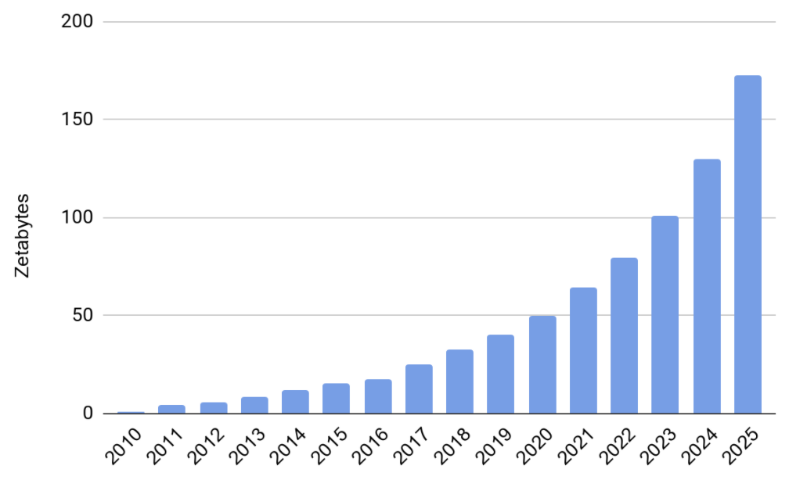

# Motivation

Filecoin is a decentralized data storage and distribution network; it is therefore necessary to place such a network in today's networking and storage market landscape. Cloud storage has evolved into an industry valued at [over $46B](https://www.alliedmarketresearch.com/cloud-storage-market) in 2019, where data is stored in enormous data centers far from end users, where space and utility costs are low. Content Delivery/Distribution Networks (CDNs) then acquire space and pack servers in data centers to cache content nearer to users. The CDN industry is currently valued at [over $12B](https://www.marketsandmarkets.com/PressReleases/cdn.asp). The rate at which we generate data is growing as video and images supplement text, resolution grows, and the number of internet-accessible devices increases. The growing amount of data stored globally is depicted in the Figure below. And the top five storage providers control [77 percent](https://www.gartner.com/en/newsroom/press-releases/2019-07-29-gartner-says-worldwide-iaas-public-cloud-services-market-grew-31point3-percent-in-2018) of the global Infrastructure as a Service (IaaS) market, making it difficult for new market entrants to compete. Any new entrant to the market must compete against the reputation, infrastructure, and potentially network effects possessed by existing providers. Without a single platform for coordination and collaboration, small entities cannot effectively compete with the capacity, scale, and reputation of existing providers.

[Figure source](https://www.seagate.com/files/www-content/our-story/trends/files/idc-seagate-dataage-whitepaper.pdf)

At the same time, the profit of CDN companies from storage and distribution is falling, due to: i) increased competition that drives prices down, ii) non-decreasing bandwidth cost, and iii) exploding demand for bandwidth from modern applications. This has led traditional CDN companies to turn to other markets and services (e.g., providing security solutions and IT services) in order to keep up with their profit expectations. 

This is where Filecoin comes in to fill the gap in the market and serve as a universal platform for low-cost and decentralised storage. The Filecoin network collapses market entry costs and allows anyone to become a storage provider, while at the same time fuelling the Filecoin Economy.

The data itself sits on a spectrum of access. Most data is never read; users simply want to know that they can access that document, photograph, record, or footage if the need arises. Alternatively, some data is accessed very frequently, or goes viral, and must be replicated across the internet to be readily available to requesters with low latency. Just as Airbnb allows homeowners to compete with hotels, the Filecoin Protocol will allow any willing and able storage provider to join a storage network and offer their storage for sale, while offloading auxiliary tasks like tooling, documentation, and branding to the Filecoin Network itself. At first, the network will be best adapted to infrequently read files, optionally supporting fast retrieval at a clientʼs request; the number of use cases will grow as the network grows, as the protocol evolves, and as tools are built. The Filecoin Network has a unique value proposition:

- **Verifiable storage:** Rather than needing to trust a cloud storage provider or rely on legal recourse, the Filecoin Protocol cryptographically verifies whether or not clients' data are being stored.
- **Open participation:** Anyone with sufficient hardware and an internet connection can participate in the Filecoin Network.
- **Distribution of storage empowers local optimization:** Driven by open participation, market forces in the Filecoin Economy should communicate information more efficiently and the network will be more responsive than centralized storage platforms. The website or video a client requested could be hosted as close as the Filecoin Mining node next door. This will increase the utility of the network by ensuring that data can be stored near the network edge, close to the clients, in a cost-effective way.
- **Flexible storage options:** Because the Filecoin Network will be an open platform, the network will support many additional tools and auxiliary services provided by the community of developers improving or building on top of the protocol.
- **The network has been built by a community:** Filecoin will be stronger because it provides participants the opportunity to obtain stake in the networkʼs success. Filecoin participants will benefit by working together to improve the Filecoin Network.

Given the growth of both demand and supply, a decentralized storage networkʼs differentiated approach to cloud storage could unlock significant efficiency improvements and growth.
