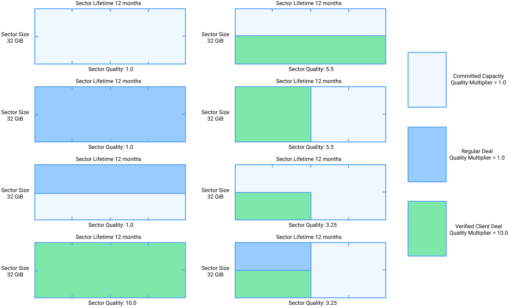

# Sector Quality

Given different sector contents, not all sectors have the same usefulness to the network. The notion of Sector Quality distinguishes between sectors with heuristics indicating the presence of valuable data. That distinction is used to allocate more subsidies to higher-quality sectors. To quantify the contribution of a sector to the consensus power of the network, some relevant parameters are described here.

- **Sector Spacetime:** This measurement is the sector size multiplied by its promised duration in byte-epochs.
- **Deal Weight:** This weight converts spacetime occupied by deals into consensus power. Deal weight of verified client deals in a sector is called Verified Deal Weight and will be greater than the regular deal weight.
- **Deal Quality Multiplier:** This factor is assigned to different deal types (committed
capacity, regular deals, and verified client deals) to reward different content.
- **Sector Quality Multiplier:** Sector quality is assigned on Activation (the epoch when the miner starts proving theyʼre storing the file). The sector quality multiplier is computed as an average of deal quality multipliers (committed capacity, regular deals, and verified client deals), weighted by the amount of spacetime each type of deal occupies in the sector.


SectorQualityMultiplier = \frac{\sum\nolimits_{deals} DealWeight * DealQualityMultiplier}{SectorSpaceTime}


- **Raw Byte Power:** This measurement is the size of a sector in bytes.
- **Quality-Adjusted Power:** This parameter measures the consensus power of stored data on the network, and is equal to Raw Byte Power multiplied by Sector Quality Multiplier.

The multipliers for committed capacity and regular deals are equal to make self dealing irrational in the current configuration of the protocol. In the future, it may make sense to pick different values, depending on other ways of preventing attacks becoming available.

The high quality multiplier and easy verification process for verified client deals facilitates decentralization of miner power. Unlike other proof-of-work-based protocols, like Bitcoin, central control of the network is not simply decided based on the resources that a new participant can bring. In Filecoin, accumulating control either requires significantly more resources or some amount of consent from verified clients, who must make deals with the centralized miners for them to increase their influence. Verified client mechanisms add a layer of social trust to a purely resource driven network. As long as the process is fair and transparent with accountability and bounded trust, abuse can be contained and minimized. A high sector quality multiplier is a very powerful leverage for clients to push storage providers to build features that will be useful to the network as a whole and increase the networkʼs long-term value. The verification process and DataCap allocation are meant to evolve over time as the community learns to automate and improve this process. An illustration of sectors with various contents and their respective sector qualities are shown in the following Figure.

**Sector Quality Adjusted Power** is a weighted average of the quality of its space and it is based on the size, duration and quality of its deals.

| Name                         | Description                                           |
|------------------------------|-------------------------------------------------------|
| QualityBaseMultiplier (QBM)  | Multiplier for power for storage without deals.       |
| DealWeightMultiplier  (DWM)  | Multiplier for power for storage with deals.          |
| VerifiedDealWeightMultiplier (VDWM) | Multiplier for power for storage with verified deals. |

The formula for calculating Sector Quality Adjusted Power (or QAp, often referred to as power) makes use of the following factors:
- `dealSpaceTime`: sum of the `duration*size` of each deal
- `verifiedSpaceTime`: sum of the `duration*size` of each verified deal
- `baseSpaceTime` (spacetime without deals): `sectorSize*sectorDuration - dealSpaceTime - verifiedSpaceTime`

Based on these the average quality of a sector is:


avgQuality = \frac{baseSpaceTime*QBM + dealSpaceTime*DWM + verifiedSpaceTime*VDWM}{sectorSize*sectorDuration*QBM}


The _Sector Quality Adjusted Power_ is:


sectorQuality = avgQuality*size


During `miner.PreCommitSector`, the sector quality is calculated and stored in the sector information.