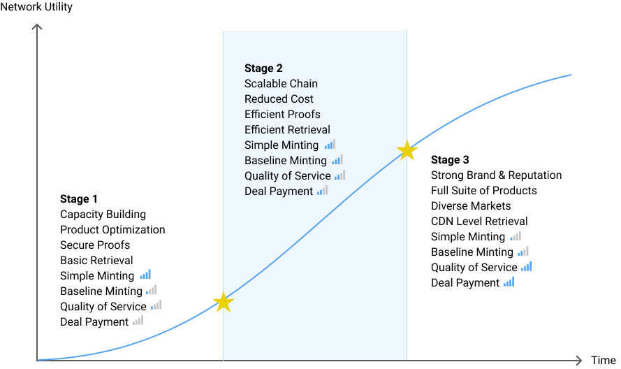

# Minting Model

Many blockchains mint tokens based on a simple exponential decay model. Under this model, block rewards are highest in the beginning, and miner participation is often the lowest, so mining generates many tokens per unit of work early in the networkʼs life, then rapidly decreases.

Over many cryptoeconomic simulations, it became clear that the simple exponential decay model would encourage short-term behavior around network launch with an unhealthy effect on the Filecoin Economy. Specifically, it would incentivize storage miners to over-invest in hardware for the sealing stage of mining to onboard storage as quickly as possible. It would be profitable to exit the network after exhausting these early rewards, even if it resulted in losing client data. This would harm the network: clients would lose data and have less access to long-term storage, and miners would have little incentive to contribute more resources to the network. Additionally, this would result in the majority of network subsidies being paid based wholly on timing, rather than actual storage (and hence value) provided to the network.

To encourage consistent storage onboarding and investment in long-term storage, not just rapid sealing, Filecoin introduces the concept of a network baseline. Instead of minting tokens based purely on elapsed time, block rewards instead scale up as total storage power on the network increases. This preserves the shape of the original exponential decay model, but softens it in the earliest days of the network. Once the network reaches the baseline, the cumulative block reward issued is identical to a simple exponential decay model, but if the network does not pass the pre-established threshold, a portion of block rewards are deferred. The overall result is that Filecoin rewards to miners more closely match the utility they, and the network as a whole, provide to clients.

Specifically, a hybrid exponential minting mechanism is introduced with a proportion of the reward coming from simple exponential decay, “Simple Minting” and the other proportion from network baseline, “Baseline Minting”. The total reward per epoch will be the sum of the two rewards. Mining Filecoin should be even more profitable with this mechanism. Simple minting allocation disproportionately rewards early miners and provides counter pressure to shocks. Baseline minting allocation mints more tokens when more value for the network has been created. More tokens are minted to facilitate greater trade when the network can unlock a greater potential. This should lead to increased creation of value for the network and lower risk of minting filecoin too quickly.

The protocol allocates 30% of Storage Mining Allocation in Simple Minting and the remaining 70% in Baseline Minting. 30% of Simple Minting can provide counter forces in the event of shocks. Baseline capacity can start from a smaller percentage of worldʼs storage today, grow at a rapid rate, and catch up to a higher but still reasonable percentage of worldʼs storage in the future. The network baseline will start from **2.5EiB**, or **2.88888888EB**, (which is less than 0.01% of the worldʼs storage today) and grow at an annual rate of 100% (higher than the usual world storage annual growth rate at 40%). The community can come together to slow down the rate of growth when the network is providing 1-10% of the worldʼs storage.

There are many features that will make passing the baseline more efficient and economical and unleash a greater share of baseline minting. The community can come together to collectively achieve these goals:

- More performant Proof of Replication algorithms, with lower on chain footprint, faster verification time, cheaper hardware requirement, different security assumptions, resulting in sectors with longer lifetime and enabling sector upgrades without reseal.
- A more scalable consensus algorithm that can provide greater throughput and handle larger volume with shorter finality.
- More deal functionalities that allow sectors to last for longer.

Lastly, it is important to note that while the block reward incentivizes participation, it cannot be treated as a resource to be exploited. It is a common pool of subsidies that seeds and grows the network to benefit the economy and participants. An example of different stages of the economy and different sources of subsidies is illustrated in the following Figure.

