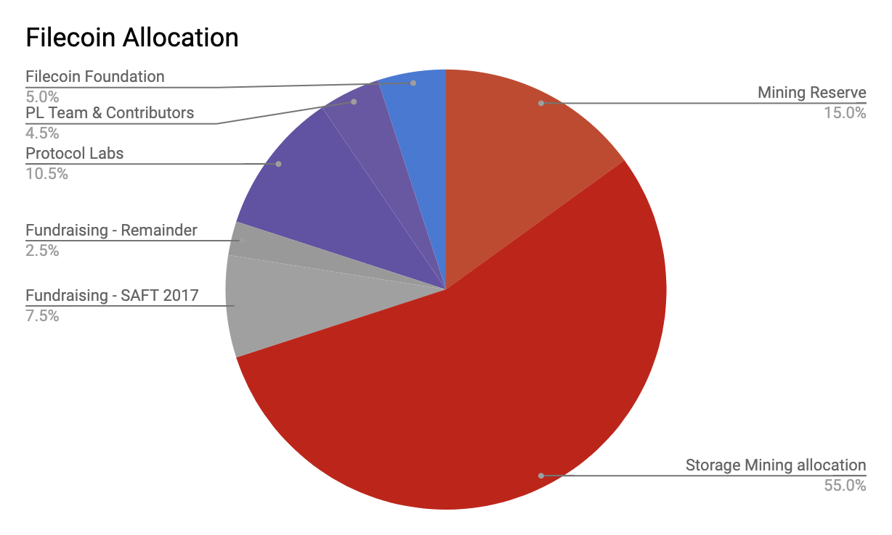

# Token Allocation

Filecoinʼs token distribution is broken down as follows. A maximum of 2,000,000,000 FIL will ever be created, referred to as `FIL_BASE`. Of the Filecoin genesis block allocation, 10% of `FIL_BASE` were allocated for fundraising, of which 7.5% were sold in the 2017 token sale, and the 2.5% remaining were allocated for ecosystem development and potential future fundraising. 15% of `FIL_BASE` were allocated to Protocol Labs (including 4.5% for the PL team & contributors), and 5% were allocated to the Filecoin Foundation. The other 70% of all tokens were allocated to miners, as mining rewards, "for providing data storage service, maintaining the blockchain, distributing data, running contracts, and more." There are multiple types of mining that these rewards will support over time; therefore, this allocation has been subdivided to cover different mining activities. A pie chart reflecting the FIL token allocation is shown in the following Figure.

**Storage Mining Allocation.** At network launch, the only mining group with allocated incentives will be storage miners. This is the earliest group of miners, and the one responsible for maintaining the core functionality of the protocol. Therefore, this group has been allocated the largest amount of mining rewards. 55% of `FIL_BASE` (78.6% of mining rewards) is allocated to storage mining. This will cover primarily block rewards, which reward maintaining the blockchain, running actor code, and subsidizing reliable and useful storage. This amount will also cover early storage mining rewards, such as rewards in the SpaceRace competition and other potential types of storage miner initialization, such as faucets.

**Mining Reserve.** The Filecoin ecosystem must ensure incentives exist for all types of miners (e.g. retrieval miners, repair miners, and including future unknown types of miners) to support a robust economy. In order to ensure the network can provide incentives for these other types of miners, 15% of `FIL_BASE` (21.4% of mining rewards) have been set aside as a Mining Reserve. It will be up to the community to determine in the future how to distribute those tokens, through Filecoin improvement proposals (FIPs) or similar decentralized decision making processes. For example, the community might decide to create rewards for retrieval mining or other types of mining-related activities. The Filecoin Network, like all blockchain networks and open source projects, will continue to evolve, adapt, and overcome challenges for many years. Reserving these tokens provides future flexibility for miners and the ecosystem as a whole. Other types of mining, like retrieval mining, are not yet subsidized and yet are very important to the Filecoin Economy; Arguably, those uses may need a larger percentage of mining rewards. As years pass and the network evolves, it will be up to the community to decide whether this reserve is enough, or whether to make adjustments with unmined tokens.

**Market Cap.** Various communities estimate the size of cryptocurrency and token networks using different analogous measures of market capitalization. The most sensible token supply for such calculations is `FIL_CirculatingSupply`, because unmined, unvested, locked, and burnt funds are not circulating or tradeable in the economy. Any calculations using larger measures such as `FIL_BASE` are likely to be erroneously inflated and not to be believed.

**Total Burnt Funds.** Some filecoin are burned to fund on-chain computations and bandwidth as network transaction fees, in addition to those burned in penalties for storage faults and consensus faults, creating long-term deflationary pressure on the token. Accompanying the network transaction fees is the priority fee that is not burned, but goes to the block-producing miners for including a transaction.

| **Parameter**  | **Value**    | **Description**     |
| :------------- | :----------: | :-----------: |
|||  |
|  `FIL_BASE` | 2,000,000,000 FIL | The maximum amount of FIL that will ever be created.  |
| `FIL_MiningReserveAlloc`  | 300,000,000 FIL | Tokens reserved for funding mining to support growth of the Filecoin Economy, whose future usage will be decided by the Filecoin community |
| `FIL_StorageMiningAlloc` | 1,100,000,000 FIL | The amount of FIL allocated to storage miners through block rewards, network initialization |
| `FIL_Vested` | Sum of genesis `MultisigActors.` `AmountUnlocked` | Total amount of FIL that is vested from genesis allocation. | 
| `FIL_StorageMined` | `RewardActor.` `TotalStoragePowerReward` | The amount of FIL that has been mined by storage miners |
| `FIL_Locked` | `TotalPledgeCollateral` + `TotalProviderDealCollateral` + `TotalClientDealCollateral` + `TotalPendingDealPayment` + `OtherLockedFunds` | The amount of FIL locked as part of mining, deals, and other mechanisms. |
| `FIL_CirculatingSupply` | `FIL_Vested` + `FIL_Mined` - `TotalBurntFunds` - `FIL_Locked` | The amount of FIL circulating and tradeable in the economy. The basis for Market Cap calculations. |
| `TotalBurntFunds` | `BurntFundsActor.` `Balance` | Total FIL burned as part of penalties and on-chain computations. |
| `TotalPledgeCollateral` | `StoragePowerActor.` `TotalPledgeCollateral` | Total FIL locked as pledge collateral in all miners. |
| `TotalProviderDealCollateral` | `StorageMarketActor.` `TotalProviderDealCollateral` | Total FIL locked as provider deal collateral |
| `TotalClientDealCollateral` | `StorageMarketActor.` `TotalClientDealColateral` | Total FIL locked as client deal collateral |
| `TotalPendingDealPayment` | `StorageMarketActor.` `TotalPendingDealPayment` | Total FIL locked as pending client deal payment |
