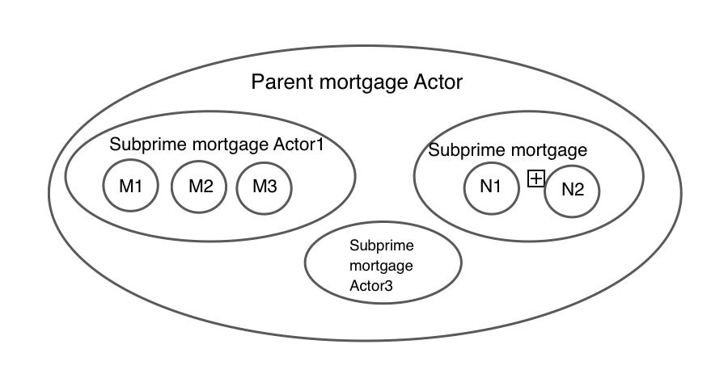
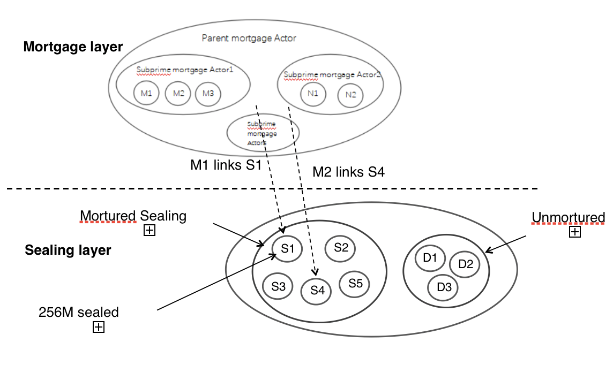
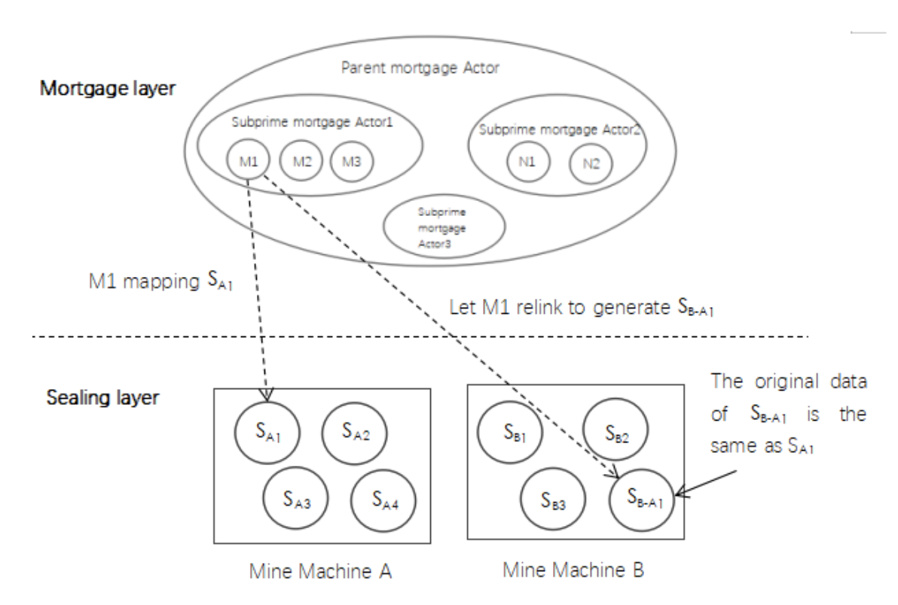
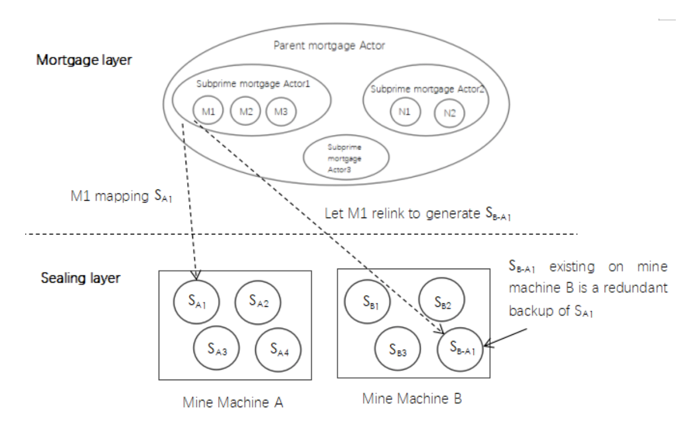
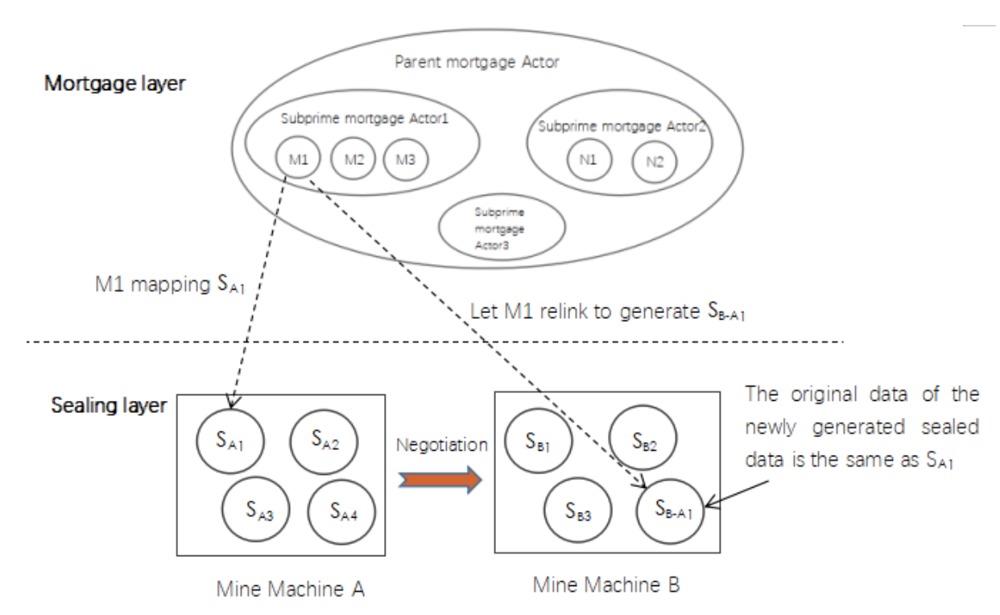

### A Proposal on Filecoin Pledge Mechanism

- Fr：Shenzhen Advance River System Technology Co.,Ltd.

## 1 Abstract
This proposal involves the Filecoin pledge mechanism, which aims to reduce the probability of  penalties under the premise of ensuring user data storage, and to avoid the miner withdrawing from the Filecoin network due to the huge penalty.

## 2 Background and purpose
In Filecoin network, storage miners provide customers with data storage. Storage miners participate in Filecoin network by providing their storage space and responding to <Put> requests.To become a storage miner, one must collateral with Filecoin which is proportional to the storage space they promise.Storage miners respond to user requests by storing data in a specific period and during which time "PoST" are generated and submitted to the blockchain to prove that they store the customer's target data for a specific period of time.If the "PoST" is invalid or lost within a given time, the storage miners will be punished and some of their collateral will be deducted by the blockchain system.

However, in fact, it is impossible for any single miner node to be 100% reliable because the machine will malfunction due to various accident such as  power failure and equipment  damage.If the collateral of the miner is deducted as soon as failure occurs, it will greatly reduce the enthusiasm of the miners.

The object of this proposal is to provide a new pledge mechanism, which provide a new guarantee mechanism for a miner node device participating in mortgage with certain fault tolerance.Even if a single node device fails, the collateral of the miner node will not be deducted if the conditions are met.

## 3 Summary of the proposal

### 3.1 Mortgage layer

We proposes a new abstraction layer called Mortgage layer which could be realized by Actor (smart contract) in the Filecoin network.In this solution, we call a mortgage instance object in the mortgage layer as Mortgage Actor. A mortgage layer can have its sub-mortgage layer, so there is an inheritance relationship between the mortgage layers. The set relation between these mortgage layers is as follows:

- The outermost big circle represents the parent mortgage layer, which contains 3 sub-mortgage Actor1, Actor2, and Actor3.
- There is an inheritance relationship between the mortgage layers, that means each sub-mortgage actor can continue to have their own sub-mortgage layer. Because of the parent relationship, the mortgage layer can continue to derived to the Nth layer.
- M1, M2, M3 are the sub-collateral layers of the mortgage layer Actor1. M1, M2, M3 are atomic-level mortgage layers, that means they have been assigned to the lowest level and cannot derive. (N1, N2 are the same. )

Note: In order to conveniently describe the structure of the mortgage layer, the below figure takes 3 layers as an example and  in practice the mortgage layer can always be derived to the Nth layer.

*Practical application*: For easily understanding, we have  visualized the abstract concept of the mortgage layer. The correspondence relationship is as follows:

Parent mortgage Actor----Mine pool (abstract space)

Sub-mortgage Actor1，Actor2，Actor3 ----Mine (the same real physical space)

Atom-level mortgage Actor: M1, M2, M3----Mining machine（a single machine）

### 3.2 Sealing layer

The sealing layer is the existing structure of Filecoin network, and the miner seals the stored data in units of sectors.At present, a sealed sector size of 256MB. We may link the sealed sector data to the mortgage layer.

Since each sealed sector has a unique ID number, we can link each sealed sector to an atomic-level mortgage actor.There is a one-to-one correspondence between sectors and mortgage Actors at each atomic level.

Each sector corresponds to a certain amount of collateral. If the sector cannot provide PoST in time, the collateral will be deducted.

### 3.3 Distinguish between two state：data failures and data migration.

  

###  3.4 Data fault rule 

- Let T_repair be the fault repair time on the blockchain network(on-chain), it indicates the maximum time that the blockchain network(on-chain) tolerates the existence of a fault.Let T_exist be the fault duration.If T_exist > T_repair,that means the network fault on-chain has not been fixed, therefore the miner's collateral will be deducted.

- Let T_fault be the mortgage layer fault tolerance time, which is a variable set value, which determines whether the mortgage layer accepts the fault of the miner who has caused the problem.During this time period, if the failure rate of a mortgage layer is >p% (for example, 5%), then the mortgage layer no longer accepts the fault declared by the corresponding miner.This is done to improve the overall reliability of the mine.

- When a fault occurs, the power of the faulty sector is not counted in the effective power.In Filecoin network, the probability that each node participates in generating a new block is proportional to its effective power.The higher the effective power of the nodes, the higher the probability that they will generate new blocks. So in this way, the Filecoin network can use economic leverage to prevent "generating attacks."

## 3.5 Data failure repair solution

### 3.5.1 Data reconstruction

Data reconstruction is a way to repair corrupted data in a mining machine. The core of the data reconstruction is that the mortgage actor how to manage and dispatch the failed mining machine.The data reconstruction is implemented as follows: The top-level mortgage layer Actor is responsible for the deployment of the data reconstruction task, and each mining machine begins to reconstruct the data after accepting the assigned task.The process of data reconstruction is to obtain data from other data sources and complete the sector sealing ,then report it to the top mortgage actor and link the mortgage and new sector.

According to the above ideas, we provide two ways to reconstruct data that can avoid unreasonable deduction of collateral.

- Generate new sealed sector

- Link to other sealed but off-chain redundant data

### 3.5.2 Implementation details

#### 3.5.1 Generate new sealed sector

When a sealed sector is “broken”, the miner reports the fault to the mortgage layer, and the mortgage layerwill link to the newly generated sealed sector to repair the corrupted data, thereby avoiding deduction of collateral.

Miners have 2 ways to generate new sealed data as below

- find the data source in the mine node and generate a new sealed sector
- obtain data sources from other miners on the blockchain and generate new sealed sectors

*Practical application*：

For example: SA1 in mine machine A fails. SA1 must have its own backup SA1’(on-chain) because Filecoin network will make redundant backups of all data.(The original data of  SA1 and SA1’is exactly the same).Now we find  SA1’and generate a new sealed sector SB-A1 on mine machine B.The new sealed data  SB-A1  has its own unique ID. We report the ID to the mortgage layer M1, and then link M1 to  SB-A1 .

#### 3.5.2 Link to other sealed but off-chain redundant data

In this solution, each sealed sector has a one-to-one correspondence with the atomic level mortgage layer.The miners make redundant backups of the data in each sealed sector (these backup data are off-chain and are not included in the effective power).When a sealed sector is "broken", the miner reports the faulty sector and the backup data location to the mortgage layer.The mortgage layer can linke to backup data (sealed but off-chain) to repair corrupted data.
Practical application
For example:The sealed sector SA1 in the mining machine A fails, and the backup data SB-A1 (off-chain) exists in the mining machine B.The miner reports the ID of SA1 to mortgage Actor1, and then mortgages the Actor1 will link to the SB-A1 .Since  SB-A1 is a redundant backup of SA1, the content stored by SB-A1 is exactly the same as that of SA1.Therefore, we just need to point the link of the mortgage Actor1 to SB-A1.

### 3.6  Active data migration 

When the miner inspects that the hardware may be malfunctioning, the data in the mortgaged sealed sector can be migrated in advance.The key to this solution is how the miner manages and migrates the sealed sectors.Data migration is implemented as follows：
- According to hardware failure prediction, miners can actively migrate data to other stable mine machines before hardware is about to fail.
- Data migration is done by miners at the same mortgage leve after negotiationl.After the data migration is completed, the miner reports the mortgage layer, and the mortgage layer links to the new sealed sector.
- Since the data migration is done off the chain, active data migration is not counted as a failure report.
The implementation of the data active migration mechanism is based on the decoupling of the mortgage layer and the sealing layer, and the link method decouples these two.In this way, the data storage layer can focus more on data protection,and  fully utilize the traditional data protection mechanism to protect the sealed sectors, and ensure that the collateral is not deducted when the failure occurs.

Practical application
For example:Mine machine A and Mine machine B are on the same mortgage layer Actor1.
Mine machine A detected that its own hard disk will be damaged. After mine machine A and mine machine B negotiated a migration agreement, mine machine A successfully migrated the original data SA1’ of data SA1 to mine machine B.Next, a new sealed sector SB-A1 is generated in the mine machine B according to SA1’,the new sealed sector SB-A1  has its own unique ID.Mine machine A reports the ID to the mortgage layer M1, and M1 will link to  SB-A1.
Since  SB-A1 is a sealed sector generated based on the data of  SA1’, the content stored by SB-A1 is exactly the same as the content of SA1.Therefore, we just need to point the link of the mortgage Actor1 to SB-A1.

